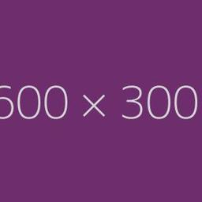
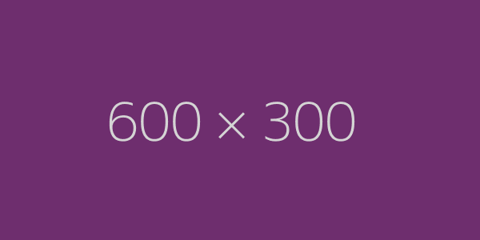
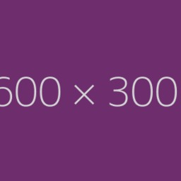

# rheactor-image-service
  

 

An image processing backend running on AWS Lambda.

Uses [gm](https://www.npmjs.com/package/gm) with GraphicsMagick (which is available by default)
on AWS lambda.

It takes JPEG or PNG images that are uploaded base64 encoded, crops and resizes them on the fly to
256x256px size, and stores them on an S3 bucket.

| Original | Result  |
|:--------:|:-------:|
|  |  |
| JPEG  | JPEG |
| 600x300  | 256x256 |
|  |  |
| PNG  | JPEG |
| 600x300  | 256x256 |
|  |  |
| JPEG  | JPEG | 
| 300x600  | 256x256 |

## Request

Users need to provide an [JsonWebToken](https://jwt.io/) which is checked against the configured public key.

    POST /upload
    Content-Type: application/vnd.resourceful-humans.rheactor-image-service.v1+json
    Authorization: Bearer <token>
    
    {
      "$context":"https://github.com/ResourcefulHumans/rheactor-image-service#Upload",
      "image":"R0lGODlhAQABAIAAAAAAAP///yH5BAEAAAAALAAAAAABAAEAAAIBRAA7",
      "mimeType":"image/png"
    }

## Response

    Content-Type: application/vnd.resourceful-humans.rheactor-image-service.v1+json
    
    {
      "$context":"https://github.com/ResourcefulHumans/rheactor-image-service#UploadResult",
      "url":"https://s3.eu-central-1.amazonaws.com/rheactor-image-service/example.com/33f24f55-e435-4198-a148-fdd1095ffa96-user-5.jpg",
      "mimeType":"image/jpeg"
    }

This implementation expects token's `sub` to be an URL, which will be used to prefix and suffix URLs. 
A `sub` value of `https://example.com/user/5` was used in the example above.

## Configuration

These environment variables need to be set on the lambda function:

 - `S3_BUCKET`  
   Name of the S3 bucket, e.g. `rheactor-image-service` to where files are uploaded.
 - `S3_REGION`  
   Region to use.
 - `MOUNT_URL`  
   Public endpoint for the lamba function (as provided by API Gateway)
 - `WEB_LOCATION`  
   Public URL for the bucket
 - `PUBLIC_KEY_FILE`  
   Public key file in the bucket to be used for verifying tokens

## Setup

    npm install
    
    # Configure these environment variables
    AWS_ROLE=…
    AWS_ACCESS_KEY_ID=…
    AWS_SECRET_ACCESS_KEY=…
    AWS_REGION=…
    AWS_FUNCTION_NAME=…
    NODE_ENV=…
    VERSION=…
    
    # install this as a new lambda function
    make install

## Live

:earth_africa: <https://vy54h2j2fj.execute-api.eu-central-1.amazonaws.com/prod>

This API is hosted as the [`rheactor-image-service`](https://eu-central-1.console.aws.amazon.com/lambda/home?region=eu-central-1#/functions/rheactor-image-service?tab=code) AWS Lambda function and the HTTP endpoint is provided via the [`rheactor-image-service`](https://eu-central-1.console.aws.amazon.com/apigateway/home?region=eu-central-1#/apis/vy54h2j2fj/stages/prod) API Gateway stage. 

The Lambda function uses the role [`rheactor-image-service`](https://console.aws.amazon.com/iam/home?region=eu-central-1#/roles/rheactor-image-service).

These environment variables have been configured on the Lamba:

 * `MOUNT_URL=https://vy54h2j2fj.execute-api.eu-central-1.amazonaws.com/prod`  
    This informations is needed for creating links to the services endpoints.
 * `S3_BUCKET=rheactor-image-service`  
    Name of the S3 bucket where to store the scaled images
 * `S3_REGION=eu-central-1`  
    Primary S3 region to use
 * `PUBLIC_KEY_FILE=networhk.prod.key`  
    The filename in the S3 bucket to load the public key from for verifying tokens
 * `WEB_LOCATION=https://s3.eu-central-1.amazonaws.com/rheactor-image-service/`  
    The URI at which the S3 bucket is hosted, the service use this to prefix the create image filenames in its response

### Deployment

:rocket: Deployment for this package is automated via [Travis CI](https://github.com/ResourcefulHumans/rheactor-image-service/blob/master/.travis.yml).  
**Every commit can potentially trigger a deploy.**

If *lint* and *test* ran without error, [`semantic-release`](https://github.com/semantic-release/semantic-release) will be used to determine the next version for the package and that version string will be written to the `package.json`. After `semantic-release` has been run, [`make update`](https://github.com/ResourcefulHumans/rheactor-image-service/blob/master/Makefile) will be executed to deploy a new release. 

If a new version has been released by `semantic-release`, `make update` will update the Lambda code. It uses these environment variables (which are [provided via Travis](https://travis-ci.org/ResourcefulHumans/rheactor-image-service/settings)):

 * `AWS_ACCESS_KEY_ID`  
   The AWS access key to use
 * `AWS_SECRET_ACCESS_KEY`  
   The AWS secret access key to use

The AWS credentials for Travis are taken from the [`rheactor-image-service@travis`](https://console.aws.amazon.com/iam/home?region=eu-central-1#/users/rheactor-image-service@travis) user.
     
You can create new AWS keys via [IAM](https://console.aws.amazon.com/iam/home?region=eu-central-1). Assign the new user to the group [`rheactor-image-service`](https://console.aws.amazon.com/iam/home?region=eu-central-1#/groups/rheactor-image-service) which has the neccessary permission to update Lambda function and write to the S3 bucket.
